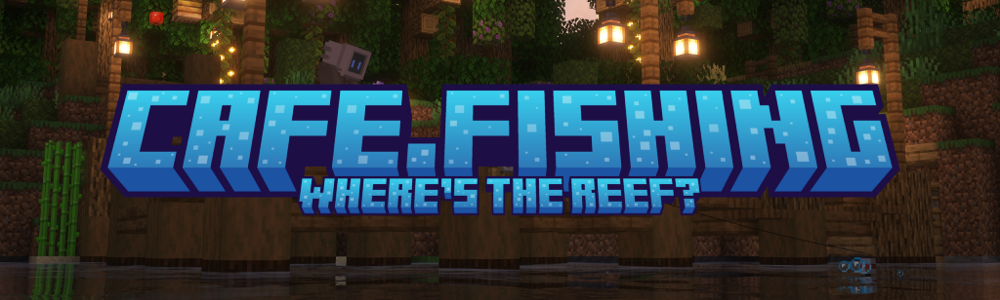
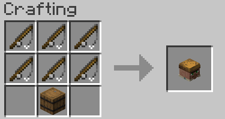
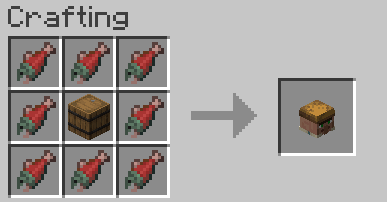
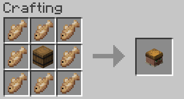
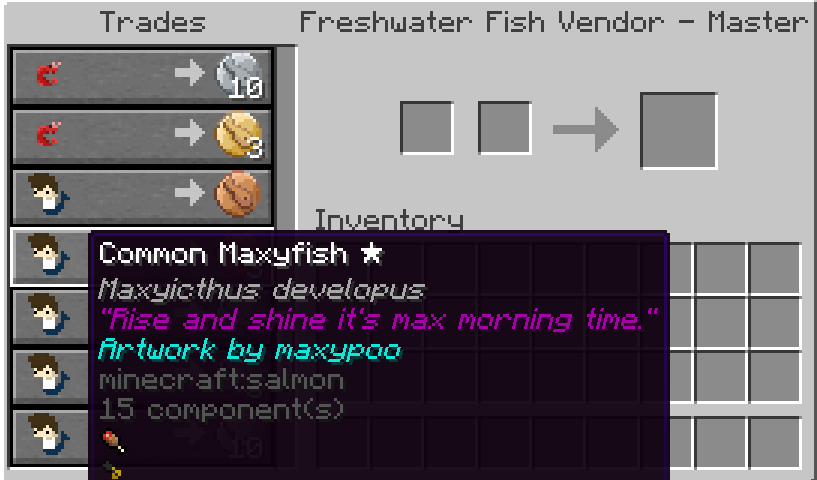
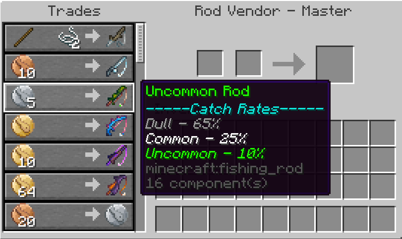
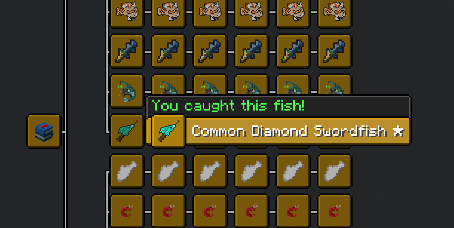

Reel in the treasures of the waters with over 60 unique fish split between both rivers and seas with fish! Cast out your line with several unique fishing rods in a survival-friendly progression system, and keep track of what you've caught in your journal!
  
Created with love by the artists of <a href="https://discord.gg/cafedot">Cafe Dot</a>†!

 

- Over 60 unique fish to catch, with a saltwater and freshwater split
- Custom artwork made by real artists, not AI
- Fishing rod tiers & progression system
- Loot notifications & fishing log—keep track of what you've caught
- Survival-friendly opt-in system

cafe.fishing is an opt-in expansion to Minecraft's fishing system. This means that you have to intentionally seek out a way to start using this datapack.
  
Craft special cafe.fishing villager conversion items. Throw these items at a villager to convert them to a special trader. These unique traders allow you to purchase special cafe.fishing rods and sell your caught fish for fish coins.
  
Keep fishing to upgrade your rod, catch higher tier fish, and complete your collection!
  

Expand to view crafting recipes and screenshots...

 

 
6 Fishing Rods + 1 Barrel = Fishing Rod Vendor Conversion Item
  

 
8 Salmon + 1 Barrel = Freshwater Vendor Conversion Item
  

 
8 Cod + 1 Barrel = Saltwater Vendor Conversion Item
  

 
Sell your fish to the fishing vendors for Fish Coins!
  

 
Upgrade your rod at the Rod Vendor for Fish Coins!
  

 
Keep track of your fishing log in the advancements tab!

In order to get the full experience, download and use the cafe.fishing resource pack alongside the datapack. It only affects fish caught from this datapack, nothing else is changed.
  
All art was hand-drawn by the lovely artists of Cafe Dot, with credits showing who drew each fish when caught. A big thank you to everyone who contributed below!
  
- asterosea 
- bethalaurus
- Calypso_Arts 
- Cisco
- erisupachin
- flawedrose
- Jabingart
- jdzombi
- Jooni
- justan oval
- maxypoo
- OHPixel
- TofuPixel
- vadim the bear
- vickyagain
- ViperiumPrime
- whiteswordmoon
  

1. Download the `cafe.fishing.zip` and `cafe.fishing-resourcepack.zip` files from the [latest release](https://github.com/maxheyn/cafe.fishing/releases/latest).
2. Extract the folder within the `cafe.fishing.zip` and place the resulting `cafe.fishing/` folder in `/datapacks` inside your Minecraft world folder.
3. Move the `cafe.fishing-resourcepack.zip` into your resource pack folder. Enable it in the Minecraft options menu.
4. Run `/reload` in-game to activate the datapack, and `/datapack list enabled` to verify it's enabled.

If still not working, try following the [datapack installation tutorial](https://minecraft.wiki/w/Tutorial:Installing_a_data_pack) on the Minecraft Wiki.

Inspired by [WEBFISHING](https://store.steampowered.com/app/3146520/WEBFISHING/) by [lamedeveloper](https://lamedeveloper.itch.io/).

† _Not directly affiliated with Cafe Dot._